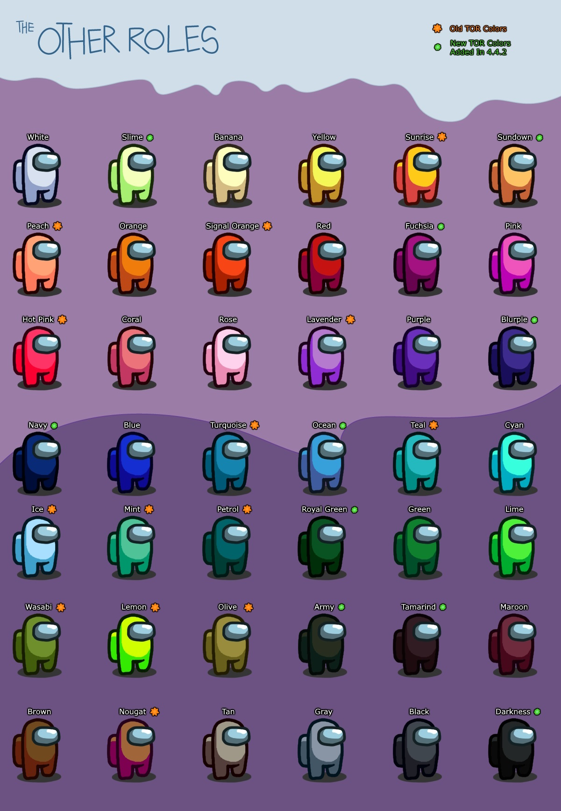

This mod is not affiliated with Among Us or Innersloth LLC, and the content contained therein is not endorsed or otherwise sponsored by Innersloth LLC. Portions of the materials contained herein are property of Innersloth LLC. © Innersloth LLC.

  To other mod devs: for usage of the code, please read and respect the <a href="#license">license</a>

# The Sushi Roles
**The Sushi Roles** is an [Among Us](https://store.steampowered.com/app/945360/Among_Us) mod, which adds many new roles, modifiers, abilities, new [Settings](#settings) and new [Custom Hats](#custom-hats) to the game.
Even more roles are coming soon.

**Roles & Modifiers List:**

| Impostor Roles | Crewmate Roles | Neutral Roles | Modifiers | Abilities |
|----------|-------------|-----------------|----------------|
| [Grenadier](#grenadier) | [Mayor](#mayor) | [Jester](#jester) | [Sleuth](#sleuth) | [Paranoid](#paranoid) |
| [Undertaker](#undertaker) | [Engineer](#engineer) | [Arsonist](#arsonist) | [Lazy](#lazy) | [Coward](#coward) |
| [Yo-Yo](#yoyo) | [Sheriff](#sheriff) | [Jackal](#jackal) | [Tie Breaker](#tie-breaker) |  |
| [Morphling](#morphling) | [Trapper](#trapper)| [Sidekick](#sidekick) | [Bait](#bait) | |
| [Camouflager](#camouflager) | [Lighter](#lighter) | [Vulture](#vulture) | [Lovers](#lovers) | |
| [Poisoner](#poisoner) | [Detective](#detective) | [Lawyer](#lawyer) | [Sunglasses](#sunglasses) | |
| [Eraser](#eraser) | [Chronos](#time-master) | [Prosecutor](#prosecutor) | [Mini](#mini) | |
| [Trickster](#trickster) | [Medic](#medic) | [Pursuer](#pursuer) | [VIP](#vip) |  |
| [Cleaner](#cleaner) | [Swapper](#swapper) | [Agent](#agent) | [Invert](#invert) | |
| [Warlock](#warlock) | [Mystic](#mystic) | [Glitch](#glitch)    | [Chameleon](#chameleon) | |
| [Bounty Hunter](#bounty-hunter) | [Hacker](#hacker) | [Juggernaut](#Juggernaut)   | [Armored](#armored) |
| [Witch](#witch) | [Tracker](#tracker) | [Predator](#serial-killer)  |  |
| [Ninja](#ninja) | [Crusader](#crusader) | [Romantic](#romantic)   |  |
| | [Spy](#spy) | [Werewolf](#werewolf) |  | |
| | [Portalmaker](#portalmaker) | [Amnesiac](#amnesiac) |  |  |
| | [Vigilante](#vigilante) |  [Plaguebearer](#plaguebearer) |  |  |
|  | [Medium](#medium) | [Pestilence](#plaguebearer)  |  |  |
|  |[Veteran](#veteran)    |  |  |  |
|  |[Oracle](#oracle) |  |  |  |
|  | [Monarch](#monarch) |  |  |

The [Role Assignment](#role-assignment) section explains how the roles are being distributed among the players.
If you want to learn how the new killers work, go to [Neutral Killers guide](#neutral-killers) to see it.

# Releases  
| Among Us - Version| The Sushi Roles Version | Link |
|----------|-------------|-----------------|
| V2024.10.29s & V2024.10.29e | v2.5.0 | [Download](https://github.com/itsjesushx/TheSushiRoles/releases/download/v2.5.0/TSR.v2.5.0.zip) |
| V2024.10.29s & V2024.10.29e | v2.2.0 | Old Codebase (Not available anymore) |
| V2024.10.29s & V2024.10.29e | v2.0.0 | Old Codebase (Not available anymore) |
| V2024.10.29s & V2024.10.29e | v1.6.0 | Old Codebase (Not available anymore) |
| V2024.10.29s & V2024.10.29e | v1.2.1 | Old Codebase (Not available anymore) |
| V2024.10.29s & V2024.10.29e | v1.2.0 | Old Codebase (Not available anymore) |
| V2024.10.29s & V2024.10.29e | v1.0.0 | Old Codebase (Not available anymore) |

-----------------------
  
# Installation

## Windows Installation Steam
1. Download the newest [release](https://github.com/itsjesushx/TheSushiRoles/releases/latest)
2. Find the folder of your game. You can right click on the game in your library, a menu will appear, click on properties, local data, browse
3. Go back one folder to common and make a copy of your Among Us game folder and paste it somewhere on the same drive.
4. Now unzip and drag or extract the files from the .zip into your Among Us game folder that you just copied, at the `.exe` level (just into the folder).
5. Run the game by starting the .exe from this folder (the first launch might take a while).

Not working? You might want to install the dependency [vc_redist](https://aka.ms/vs/16/release/vc_redist.x86.exe)

## Windows Installation Epic
1. Download the newest [release](https://github.com/itsjesushx/TheSushiRoles/releases/latest)
2. Find the folder of your game. Should be stored in "Epic/AmongUs" (wherever you installed Epic on your PC)
3. Now unzip and drag or extract the files from the .zip into the original Epic Among Us game folder.
4. Run the game by starting the game in your Epic Games launcher (the first launch might take a while).

Not working? You might want to install the dependency [vc_redist](https://aka.ms/vs/16/release/vc_redist.x86.exe)

## Linux Installation
1. Install Among Us via Steam
2. Download newest [release](https://github.com/itsjesushx/TheSushiRoles/releases/latest) and extract it to ~/.steam/steam/steamapps/common/Among Us
3. Enable winhttp.dll via the proton winecfg (https://docs.bepinex.dev/articles/advanced/proton_wine.html)
4. Launch the game via Steam

# Credits & Resources
**Thanks to [TheOtherRoles](https://github.com/TheOtherRolesAU/TheOtherRoles) for providing the mod's codebase!**
Thanks to miniduikboot & GD for hosting modded servers!

[MyDragonBreath](https://github.com/myDragonBreath/AmongUs.MultiClientInstancing) - for TheSushiRoles Debugger.
[OxygenFilter](https://github.com/NuclearPowered/Reactor.OxygenFilter) - For all the versions between v2.3.0 and v2.6.1, we were using the OxygenFilter for automatic deobfuscation\
[Reactor](https://github.com/NuclearPowered/Reactor) - The framework used for all versions before v2.0.0\
[BepInEx](https://github.com/BepInEx) - Used to hook to game functions\
[Essentials](https://github.com/DorCoMaNdO/Reactor-Essentials) - Custom game options by **DorCoMaNdO**:
- Before v1.6: We used the default Essentials release
- v1.6-v1.8: We slightly changed the default Essentials release. The changes can be found on this [branch](https://github.com/Eisbison/Reactor-Essentials/tree/feature/TheOtherRoles-Adaption) of our fork.
- v2.0.0 and later: We're no longer using Reactor anymore we are using our own implementation inspired by the one from **DorCoMaNdO**

[Jackal and Sidekick](https://www.twitch.tv/dhalucard) - Original idea for the Jackal and Sidekick came from **Dhalucard**\
[Among-Us-Love-Couple-Mod](https://github.com/Woodi-dev/Among-Us-Love-Couple-Mod) - Idea for the Lovers modifier came from **Woodi-dev**\
[Jester](https://github.com/Maartii/Jester) - Idea for the Jester role came from **Maartii**\
[ExtraRolesAmongUs](https://github.com/NotHunter101/ExtraRolesAmongUs) - Idea for the Engineer and Medic role came from **NotHunter101**. Also some code snippets from their implementation were used.\
[Among-Us-Sheriff-Mod](https://github.com/Woodi-dev/Among-Us-Sheriff-Mod) - Idea for the Sheriff role came from **Woodi-dev**\
[TooManyRolesMods](https://github.com/Hardel-DW/TooManyRolesMods) - Idea for the Detective and Chronos roles came from **Hardel-DW**. Also some code snippets from their implementation were used.\
[TownOfUs](https://github.com/slushiegoose/Town-Of-Us) - Idea for the Swapper, Arsonist and a similar Mayor role came from **Slushiegoose**\
[Ottomated](https://twitter.com/ottomated_) - Idea for the Morphling and Camouflager role came from **Ottomated**\
[Crowded-Mod](https://github.com/CrowdedMods/CrowdedMod) - Our implementation for 10+ player lobbies were inspired by the one from the **Crowded Mod Team**\
[Goose-Goose-Duck](https://store.steampowered.com/app/1568590/Goose_Goose_Duck) - Idea for the Vulture role came from **Slushiegoose**\
[TheEpicRoles](https://github.com/LaicosVK/TheEpicRoles) - Idea for the first kill shield (partly) and the tabbed option menu (fully + some code), by **LaicosVK** **DasMonschta** **Nova**\
[Ninja](#ninja), [Lawyer](#lawyer) / [Pursuer](#pursuer), [Portalmaker](#portalmaker), [Guesser Modifier](#guesser-modifier) - Idea: [K3ndo](https://github.com/K3ndoo) ; Developed by [Gendelo](https://github.com/gendelo3) & [Mallöris](https://github.com/Mallaris) \
[ugackMiner53](https://github.com/ugackMiner53/PropHunt) - Idea and core code for the Prop Hunt game mode

# Settings
The mod adds a few new settings to Among Us (in addition to the role settings):
- **Any Player Can Stop The Start:** If turned off, only the host can stop the game start. If on, all players can do it. Non-hosts stopping the start will send a chat message indicating who stopped it.
- **Number of Crewmates:** The number of Crewmate roles can be set inside a lobby.
- **Number of Neutrals:** The number of Neutral roles can be set inside a lobby.
- **Number of Neutral Killers:** The number of Neutral Killing roles can be set inside a lobby.
- **Number of Impostors:** The number of Impostor roles can be set inside a lobby.
- **Number of Modifiers:** The number of Modifiers can be set inside a lobby.
- **Map:** The map can be changed inside a lobby.
- **Maximum Number Of Meetings:** You can set the maximum number of meetings that can be called in total (Every player still has personal maximum of buttons, but if the maximum number of meetings is reached you can't use your meetings even if you have some left. Impostor and Jackal meetings also count).
- **Allow Skips On Emergency Meetings:** If set to false, there will not be a skip button in emergency meetings. If a player does not vote, they'll vote themself.
- **Hide Player Names:** Hides the names of all players that have role which is unknown to you. Team Lovers/Impostors/Jackal still see the names of their teammates. Impostors can also see the name of the Spy and everyone can still see the age of the mini.
- **Allow Parallel MedBay Scans:** Allows players to perform their MedBay scans at the same time.
- **Shield Last Game First Kill** The first killed player of the previous round will be shielded for all players visible until the first meeting.
- **Finish Tasks Before Haunting Or Zooming Out ** The zoom out function as well as haunting will be hidden for the player until all their tasks are finished
- **Disable MedbayWalk Animation:** Disables the visual walk that a player makes when they start to walk to the scanner.
- **Enable Better Skeld Vent Improvements:** Enable this to drastically change
- **Enable Better Polus Features:** Using better polus plugin, but its built inside the mod.
- **Admin Table Shows Dead Bodies**
- **Cams Switch To Night Vision If Lights Are Off**  No colors and cosmetics can be seen on the cameras when the lights are off. Mini can be spottet!
- **Impostor Vision Ignores Night Vision Cams**
- **Play On A Random Map** If enabled it allows you to set percentages for each current map, except ehT dlekS. 
- **Ghosts Can See Roles.**
- **Ghosts Can See Votes.**
- **Ghosts Can Additionally See Modifier.**
- **Ghosts See Tasks And Other Info** Other Info: Things like who is cursed, cuffed etc. but also the medic shield, flashes, engineer fix etc.
- **The map is accessable during a meeting and will show your last location when a body gets reported/meeting gets called.**
- **When you're a ghost and done with tasks, you'll get a zoom out/overview function.**
- **Task Counts:** You are now able to select more tasks.
- **Enable Random Player Spawns:** You will have a random spawn after every meeting/when the game starts.
- **Role Summary:** When a game ends there will be a list of all players, their roles, their task progression and how many player a killer killed.
- **Darker/Lighter:** Displays color type of each player in meetings.
- **Show The Settings In-Game** You can use the button located under the map button or the F1-key to open or close the display of the lobby settings

### Task Count Limits per map
You can configure:
- Up to 4 common tasks
- Up to 23 short tasks
- Up to 15 long tasks

Please note, that if the configured option exceeds the available number of tasks of a map, the tasks will be limited to that number of tasks. \
Example: If you configure 4 common tasks on Airship crewmates will only receive 2 common tasks, as airship doesn't offer more than 2 common tasks.
-----------------------

### Random Maps
**Play On A Random Map** If enabled it allows you to set percentages for each current map.

**Finish Tasks Before Haunting Or Zooming Out** You have to finish your tasks before you get the possibility to zoom out.

**Use Random Map Setting Presets:** When this option is turned on, the game will switch to the `Random Preset <MapName>` when a game is started on a random map. **This includes vanilla options!**. This makes it possible to e.g. play with less tasks on large maps like Airship.
The game will **remain** in the preset for that random map after the match.

The random map presets can still be used like normal presets, if you **turn of** `Play On A Random Map` (make sure you do this in all presets you are using).

# Custom Hats
## Create and submit new hat designs
We're awaiting your creative hat designs and we'll integrate all the good ones in our mod.
Here are a few instructions, on how to create a custom hat:

- **Creation:** A hat consists of up to three textures. The aspect ratio of the textures has to be `4:5`, we recommend `300px:375px`:
  - `Main texture (required)`:
    - This is the main texture of your hat. It will usually be rendered in front of the player, if you set the `behind` parameter it will be rendered behind the player.
    - The name of the texture needs to follow the pattern *hatname.png*, but you can also set some additional parameters in the file name by adding `_parametername` to the file name (before the *.png*).
    - Parameter `bounce`: This parameter determines whether the hat will bounce while you're walking or not.
    - Parameter `adaptive`: If this parameter is set, the Among Us coloring shader will be applied (the shader that replaces some colors with the colors that your character is wearing in the game). The color red (#ff0000) will be replaced with the primary color of your player and the color blue (#0000ff) with the secondary color. Also other colors will be affected and changed, you can have a look at the texture of the [Crewmate Hat](https://static.wikia.nocookie.net/among-us-wiki/images/e/e0/Crewmate_hat.png) to see how this feature should be used.
    - Parameter `behind`: If this parameter is set, the main texture will be rendered behind the player.
  - `Flipped texture (optional)`:
    - This texture will be rendered instead of the Main texture, when facing the left.
    - The name of the texture needs to follow the pattern `hatname_flip.png`.
  - `Back texture (optional)`:
    - This texture will be rendered behind the player.
    - The name of the texture needs to follow the pattern `hatname_back.png`.
  - `Flipped Back texture (optional)`:
    - This texture will be rendered instead of the Back texture, when facing the left.
    - The name of the texture needs to follow the pattern `hatname_back_flip.png`.
  - `Climb texture (optional)`:
    - This texture will be rendered in front of the player, when they're climbing.
    - The name of the texture needs to follow the pattern `hatname_climb.png`.
- **Testing:** You can test your hat design by putting all the files in the `\SushiAssets\Test` subfolder of your mod folder. Then whenever you start a Freeplay game, you and all the dummies will be wearing the new hat. You don't need to restart Among Us if you change the hat files, just exit and reenter the Freeplay mode.

# Colors
Note: Lighter and Darker colors are no longer based on the players color. Instead they are assigned alternatingly, s.t. they are always balanced in a lobby.

A big thank you goes to Avlona & Listoric for sorting the colors in the best possible order (which is surprisingly hard to do)!

# Roles

## Role Assignment

First you need to choose how many special roles of each kind (Impostor/Neutral/Crewmate) you want in the game.
The count you set will only be reached, if there are enough Crewmates/Impostors in the game and if enough roles are set to be in the game (i.e. they are set to > 0%). The roles are then being distributed as follows:
- First all roles that are set to 100% are being assigned to arbitrary players.
- After that each role that has 10%-90% selected adds 1-9 tickets to a ticket pool (there exists a ticket pool for Crewmates, Neutrals and Impostors). Then the roles will be selected randomly from the pools as long it's possible (until the selected number is reached, until there are no more Crewmates/Impostors or until there are no more tickets). If a role is selected from the pool, obviously all the tickets of that role are being removed.
- The Lovers and Mini are being selected independently (without using the ticket system) according to the spawn chance you selected. After that the Crewmate, Neutral and Impostor roles are selected and assigned in a random order.

**Example:**\
Settings: 2 special Crewmate roles, Crusader: 100%, Hacker: 10%, Tracker: 30%\
Result: Crusader is assigned, then one role out of the pool [Hacker, Tracker, Tracker, Tracker] is being selected\
Note: Changing the settings to Hacker: 20%, Tracker: 60% would statistically result in the same outcome .

## Morphling
### **Faction: Impostors**
The Morphling is an Impostor which can additionally scan the appearance of a player.\
After an arbitrary time they can take on that appearance for a set duration which can be changed in the options.\
\
**NOTE:**
- They shrink to the size of the Mini when they copy its look.
- The Hacker sees the new color on the admin table.
- The color of the footprints changes accordingly (also the ones that were already on the ground).
- The other Impostor still sees that they are an Impostor (the name remains red).
- The shield indicator changes accordingly (the Morphling gains or loses the shield indicator).
- Tracker arrows keep working.

### Game Options
| Name | Description |
|----------|:-------------:|
| Morphling Spawn Chance | -
| Morphling Cooldown | -
| Morph Duration | Time the Morphling stays morphed
-----------------------

## Camouflager
### **Faction: Impostors**
The Camouflager is an Impostor which can additionally activate a camouflage mode.\
The camouflage mode lasts for 10s and while it is active, all player names/pets/hats\
are hidden and all players have the same color.\
\
**NOTE:**
- The Mini will look like all the other players
- The color of the footprints turns gray (also the ones that were already on the ground).
- The Hacker sees gray icons on the admin table
- The shield is not visible anymore
- Tracker arrows keep working

### Game Options
| Name | Description |
|----------|:-------------:|
| Camouflager Spawn Chance | -
| Camouflager Cooldown | -
| Camo Duration | Time players stay camouflaged
-----------------------

## Poisoner
### **Faction: Impostors**
The Poisoner is an Impostor, that can bite other player. Poisoned players die after a configurable amount of time\
The Poisoner can also place blind traps in the map, if a player steps on them, they can't use Vent or report buttons (Clicking a body even if you are blind won't work either) and won't see anything.\
\
**NOTE:**
- If a poisoned player is still alive when a meeting is being called, they die at the start of the meeting.
- The Cooldown is the same as the default kill Cooldown (+ the kill delay if the Poisoner bites the target).
- If there is a Poisoner in the game, there can't be a Warlock.
- If the Poisoner bites a player and gets killed before the bite is performed, the biten player will survive.

### Game Options
| Name | Description |
|----------|:-------------:|
| Poisoner Spawn Chance | -
| Poisoner Kill Delay | -
| Poisoner Cooldown | Sets the kill/bite Cooldown
| Blind Cooldown | -
| Blind Duration | -
-----------------------

## Eraser
### **Faction: Impostors**
The Eraser is an Impostor that can erase the role of every player.\
The targeted players will lose their role after the meeting right before a player is exiled.\
After every erase, the Cooldown increases by 10 seconds.\
The erase will be performed, even if the Eraser or their target die before the next meeting.\
By default the Eraser can erase everyone but the Spy and other Impostors.\
Depending on the options they can also erase them (Impostors will lose their special Impostor ability).\
\
**NOTE:**
- As the erase is being triggered before the ejection of a player, a Jester win would not happen, as the erase will be triggered before.
- Modifier will not be erased.

### Game Options
| Name | Description |
|----------|:-------------:|
| Eraser Spawn Chance | -
| Eraser Cooldown | The Eraser's Cooldown will increase by 10 seconds after every erase.
| Eraser Can Erase Anyone | If set to false, they can't erase the Spy and other Impostors
-----------------------

## Trickster
### **Faction: Impostors**
The Trickster is an Impostor that can place 3 jack-in-the-boxes that are invisible at first to other players.\
If the Trickster has placed all of their boxes they will be converted into a vent network usable only by the Trickster themself, but the boxes are revealed to the others.\
If the boxes are converted to a vent network, the Trickster gains a new ability "Lights out" to limit the visibility of Non-Impostors, that cannot be fixed by other players. Lights are automatically restored after a while.\
\
**NOTE:**
- Impostors will get a text indicator at the bottom of the screen to notify them if the lights are out due to the Trickster ability, as there is no sabotage arrows or task to sabotage text to otherwise notify them about it.

### Game Options
| Name | Description |
|----------|:-------------:|
| Trickster Spawn Chance | -
| Trickster Box Cooldown | Cooldown for placing jack-in-the-boxes
| Trickster Lights Out Cooldown | Cooldown for their "lights out" ability
| Trickster Lights Out Duration | Duration after which the light is automatically restored
-----------------------

## Cleaner
### **Faction: Impostors**
The Cleaner is an Impostor who has the ability to clean up dead bodies.\
\
**NOTE:**
- The Kill and Clean Cooldown are shared, preventing them from immediately cleaning their own kills.
- If there is a Cleaner in the game, there can't be a Vulture.

### Game Options
| Name | Description |
|----------|:-------------:|
| Cleaner Spawn Chance | -
| Cleaner Cooldown | Cooldown for cleaning dead bodies
-----------------------

## Warlock
### **Faction: Impostors**
The Warlock is an Impostor, that can curse another player (the cursed player doesn't get notified).\
If the cursed person stands next to another player, the Warlock is able to kill that player (no matter how far away they are).\
Performing a kill with the help of a cursed player, will lift the curse and it will result in the Warlock being unable to move for a configurable amount of time.\
The Warlock can still perform normal kills, but the two buttons share the same Cooldown.\
\
**NOTE:**
- The Warlock can always kill their Impostor mates (and even themself) using the "cursed kill"
- If there is a Warlock in the game, there can't be a Poisoner
- Performing a normal kill, doesn't lift the curse

### Game Options
| Name | Description |
|----------|:-------------:|
| Warlock Spawn Chance | -
| Warlock Cooldown | Cooldown for using the Curse and curse Kill
| Warlock Root Time | Time the Warlock is rooted in place after killing using the curse
-----------------------

## Bounty Hunter
### **Faction: Impostors**
The Bounty Hunter is an Impostor, that continuously get bounties (the targeted player doesn't get notified).\
The target of the Bounty Hunter swaps after every meeting and after a configurable amount of time.\
If the Bounty Hunter kills their target, their kill Cooldown will be a lot less than usual.\
Killing a player that's not their current target results in an increased kill Cooldown.\
Depending on the options, there'll be an arrow pointing towards the current target.\
\
**NOTE:**
- The target won't be an Impostor, a Spy or the Bounty Hunter's Lover.
- Killing the target resets the timer and a new target will be selected.

### Game Options
| Name | Description |
|----------|:-------------:|
| Bounty Hunter Spawn Chance | -
| Duration After Which Bounty Changes | -
| Cooldown After Killing Bounty | -
| Additional Cooldown After Killing Others | Time will be added to the normal impostor Cooldown if the Bounty Hunter kills a not-bounty player
| Show Arrow Pointing Towards The Bounty | If set to true an arrow will appear (only visiable for the Bounty Hunter)
| Bounty Hunter Arrow Update Interval | Sets how often the position is being updated
-----------------------

## Witch
### **Faction: Impostors**
The Witch is an Impostor who has the ability to cast a spell on other players.\
During the next meeting, the spellbound player will be highlighted and they'll die right after the meeting.\
There are multiple options listed down below with which you can configure to fit your taste.\
Similar to the Poisoner, shields and blanks will be checked twice (at the end of casting the spell on the player and at the end of the meeting, when the spell will be activated).\
This can result in players being marked as spelled during the meeting, but not dying in the end (when they get a shield or the Witch gets blanked after they were spelled by the Witch).\
If the Witch dies before the meeting starts or if the Witch is being guessed during the meeting, the spellbound players will be highlighted but they'll survive in any case.\
Depending on the options you can choose whether voting the Witch out will save all the spellbound players or not.\
\
**NOTE:**
- The spellbound players will die before the voted player dies (which might trigger e.g. trigger an Impostor win condition, even if the Witch is the one being voted)

### Game Options
| Name | Description |
|----------|:-------------:|
| Witch Spawn Chance | -
| Witch Spell Casting Cooldown | -
| Witch Additional Cooldown | The spell casting Cooldown will be increased by the amount you set here after each spell
| Witch Can Spell Everyone | If set to false, the witch can't spell the Spy and other Impostors
| Witch Spell Casting Duration | The time that you need to stay next to the target in order to cast a spell on it
| Trigger Both Cooldowns | If set to true, casting a spell will also trigger Cooldown of the kill button and vice versa (but the two Cooldowns may vary)
| Voting The Witch Saves All The Targets | If set to true, all the cursed targets will survive at the end of the meeting
-----------------------

## Grenadier
### **Faction: Impostors**

The Grenadier is an Impostor that can throw smoke grenades.\
During the game, the Grenadier has the option to throw down a smoke grenade which blinds crewmates so they can't see.\
The Spy, the Grenadier, other Impostors and dead people won't be affected by the grenades.

### Game Options
| Name | Description |
|----------|:-------------:|
| Grenadier Spawn Chance | -
| Flash Grenade Cooldown | -
| Flash Grenade Duration | -
| Flash Radius | How wide the flash radius is
-----------------------

## Ninja
### **Faction: Impostors**
The Ninja is an Impostor who has the ability to kill another player all over the map.\
You can mark a player with your ability and by using the ability again, you jump to the position of the marked player and kill it.\
Depending on the options you know where your marked player is.\
If the Ninja uses its ability, it will leave a trace (leaves) for a configurable amount of time where it activated the ability and additionally where it killed the before marked player.\
When performing a ninja ability kill, the ninja can be invisible for some seconds (depends on options)\
\
**NOTE:**
- The Ninja has a 5 second Cooldown after marking a player
- The trace has a darker (black) or lighter (white) color depending on the players color that will fade into green
- The mark on the marked player will reset after a meeting or after using the ability to kill the marked player. Performing a normal kill will **NOT** reset the mark
- If the Ninja tries to kill a shielded player (e.g. Medic shield, Shield last game first kill ), the kill will not be performed
- If the marked target is on a different floor on Submerged, the arrow will always point to the elevator

### Game Options
| Name | Description |
|----------|:-------------:|
| Ninja Spawn Chance | -
| Ninja Mark Cooldown | -
| Ninja Knows Location Of Target | -
| Trace Duration | -
| Time Till Trace Color Has Faded | -
| Time The Ninja Is Invisible | -
-----------------------

## YoYo
### **Faction: Impostors**
The Yo-Yo is an Impostor who has the ability mark a position and later blink (teleport) to this position.\
After the initial blink, the Yo-Yo has a fixed amount of time (option) to do whatever they want, before automatically blinking back to the starting point of the first blink.\
Each blink leaves behind a silhouette with configurable transparency. The silhouette is very hard to see.\
The Yo-Yo may also have access to a mobile admin table, depending on the settings.

**NOTE:**

- The marked position for the first jump's target is displayed to the Yo-Yo and ghosts only.
- The silhouette of the first blink stays (almost) until the Yo-Yo returns
- The silhouette of the second blink (return) stays for 5 seconds

### Game Options
| Name | Description |
|----------|:-------------:|
| Yo-Yo Spawn Chance | -
| Blink Duration | -
| Mark Location Cooldown | -
| Marked Location Stays After Meeting | -
| Has Admin Table | -
| Admin Table Cooldown | -
| Silhouette Visibility | -
-----------------------

## Undertaker
### **Faction: Impostors**

The Undertaker is an Impostor that can drag and drop bodies.\
They can vent while dragging bodies, the body will be visible on top of the vent the Undertaker is hidden on.

### Game Options
| Name | Description |
|----------|:-------------:|
| Undertaker Spawn Chance | -
| Undertaker Drag Cooldown | -
| Undertaker Speed While Dragging | -

-----------------------

## Guesser
### **Faction: Crewmates, Neutral Killers, or Impostors**
The Guesser can be a Crewmate or an Impostor (depending on the settings).\
The Guesser can shoot players during the meeting, by guessing its role. If the guess is wrong, the Guesser dies instead.\
You can select how many players can be shot per game and if multiple players can be shot during a single meeting.\
The guesses Impostor and Crewmate are only right, if the player is part of the corresponding team and has no special role.\
You can only shoot during the voting time.\
Depending on the options, the Guesser can't guess the shielded player and depending on the Medic options the Medic/shielded player might be notified (no one will die, independently of what the Guesser guessed).\
\
**NOTE:**
- If a player gets shot, you'll get back your votes
- Jester wins won't be triggered, if the Guesser shoots the Jester before the Jester gets voted out

### Game Options
| Name | Description |
|----------|:-------------:|
| Guesser Spawn Chance | -
| Chance That The Guesser Is An Impostor | -
| Guesser Number Of Shots Per Game | -
| Guesser Can Shoot Multiple Times Per Meeting |  -
| Guesses Visible In Ghost Chat | -
| Guesses Ignore The Medic Shield | -
| Evil Guesser Can Guess The Spy | -
| Both Guesser Spawn Rate | -

-----------------------

## Jester
### **Faction: Neutral (Evil)**
The Jester does not have any tasks. They win the game as a solo, if they get voted out during a meeting.

### Game Options
| Name | Description |
|----------|:-------------:|
| Jester Spawn Chance | -
| Jester Can Call Emergency Meeting | Option to disable the emergency button for the Jester
|Jester Has Impostor Vision | -
-----------------------

## Arsonist
### **Faction: Neutral (Evil)**
The Arsonist does not have any tasks, they have to win the game as a solo.\
The Arsonist can douse other players by pressing the douse button and remaining next to the player for a few seconds.\
If the player that the Arsonist douses walks out of range, the Cooldown will reset to 0.\
After dousing everyone alive the Arsonist can ignite all the players which results in an Arsonist win.

### Game Options
| Name | Description |
|----------|:-------------:|
| Arsonist Spawn Chance | -
| Arsonist Cooldown | -
| Arsonist Douse Duration | The time it takes to douse a player
-----------------------

## Neutral Killers
The Neutral Killers enable multiple new outcomes of the game, listing some examples here:
- The Impostors could be eliminated and then the crew plays against any Neutral Killer.
- The Crew could be eliminated, then any alive Neutral Killer fight against the Impostors (or against another Neutral Killer, or a Crewmate Power role) (The Crew can still make a task win in this scenario)

The priority of each Neutral Killer win condition is the following:
1. Crewmate Mini lose by vote
2. Any Neutral Evil Win
3. Team Impostor wins by sabotage
4. Team Crew wins by tasks (also possible if the whole Crew is dead)
5. Lovers among the last three players win
6. Any Neutral Killer wins by outnumbering (When the Neutral Killer contains an equal or greater amount of players than the Crew and there are 0 Impostors left, and no other Neutral killers are alive and the same Neutral Killer contains no Lover)
7. Team Impostor wins by outnumbering (When the team Impostors contains an equal or greater amount of players than the Crew and there are 0 Neutral Killers and team Impostors contains no Lover)
8. Team Crew wins by outnumbering (When there is no player that is a Neutral Killer and the team Impostors left)

**NOTE:**
- The game will NOT end if one of these crewmate roles are alive with the last killers: Sheriff, Mayor, Veteran (with charges), Swapper or if a Crewmate Tiebreaker is alive.
- The Neutral Killers may be killed by a Sheriff.
- A Neutral Killer cannot target the Mini (excluding Glitch), while it's growing up. After that they can kill it or interact with them.
- The Crew can still win, even if all of their members are dead, if they finish their tasks fast enough (That's why converting the last Crewmate with tasks left into a Sidekick results in a task win for the crew.)

If Impostors and multiple Neutral Killers are in the game, the game continues even if all Crewmates are dead. Crewmates may still win in this case by completing their tasks. Each Neutral Killer and Impostor have to kill each other.

-----------------------

## Jackal
### **Team: Jackal**
### **Faction: Neutral**
### **Alignment: Neutral Killing**
The Jackal is part of an extra team, that tries to eliminate all the other players.\
The Jackal has no tasks and can kill Impostors, Crewmates and Neutrals.\
The Jackal (if allowed by the options) can select another player to be their Sidekick.
Creating a Sidekick adds them to the team Jackal. The Sidekick keeps their current role if they are a lover, they got 3 teams where they could possibly win.
The "Create Sidekick Action" may only be used once per game.
If An Amnesiac remembers a Jackal, the current Jackal's Sidekick will be removed. And Amnesiac will be a Sidekick instead.

### Game Options
| Name | Description
|----------|:-------------:|
| Jackal Spawn Chance | -
| Team Jackal Kill Cooldown | Kill Cooldown |
| Jackal Create Sidekick Cooldown | Cooldown before a Sidekick can be created |
| Jackal Can Use Vents | Yes/No |
| Jackal Can Create A Sidekick | Yes/No |
| Sidekick Can Vent | Yes/No |
| Team Jackal Have Impostor Vision | -
-----------------------

## Sidekick
### **Team: Jackal**
### **Faction: Neutral**
### **Alignment: Neutral Killing**
Gets assigned to a player during the game by the "Create Sidekick Action" of the Jackal and joins the Jackal in their quest to eliminate all other players.\
\
**NOTE:**
- The original faction of the player will be changed to Neutral, so they count as a Jackal.
- The original alignment of the player will be changed to Neutral Killing, so they count as a Jackal.
- The Sidekick may be killed by a Sheriff.
- The Sidekick cannot target the Mini, while it's growing up.

### Game Options
| Name | Description
|----------|:-------------:|
| Team Jackal Kill Cooldown | Uses the same kill Cooldown setting as the Jackal |
| Sidekick Can Use Vents | Yes/No |
-----------------------

## Juggernaut
### **Faction: Neutral**
### **Alignment: Neutral Killing**

The Juggernaut is a Neutral role with its own win condition.\
The Juggernaut's special ability is that their kill Cooldown reduces with each kill.\
This means in theory the Juggernaut can have a 0 second kill Cooldown!\
The Juggernaut needs to be the last killer alive to win the game.
### Game Options
| Name | Description
|----------|:-------------:|
| Juggernaut Spawn Chance  | -
| Juggernaut Kill Cooldown | -
| Reduced Kill Cooldown Per Kill | -
| Juggernaut can Vent | Whether the Juggernaut can Vent | Yes / No

-----------------------

## Glitch
### **Faction: Neutral**
### **Alignment: Neutral Killing**

Glitch is a Neutral role with its own win condition.\
Glitch's aim is to kill everyone and be the last person standing.\
Glitch can Hack players, resulting in them being unable to report bodies and do tasks.\
Hacking prevents the hacked player from doing anything but walk around the map.\
This role cannot spawn on Fungle.\
Glitch can Mimic someone, which results in them looking exactly like the other person.

### Game Options
| Name | Description
|----------|:-------------:|
| Glitch Spawn Chance | -
| Mimic Cooldown | -
| Mimic Duration | -
| Hack Cooldown | -
| Hack Duration | -
| Glitch Kill Cooldow | -
| Glitch can Vent | Whether Glitch can Vent | Yes / No

-----------------------

## Werewolf
### **Faction: Neutral**
### **Alignment: Neutral Killing**

The Werewolf can kill all players within a certain radius.

### Game Options

| Name | Description
|------|-------------|
| Werewolf Spawn Chance | -
| Maul Cooldown | -
| Maul Radius | How far must a player be to survive a Werewolf's attack  | -
| Werewolf Can Vent | Toggles the Werewolf's ability to vent | Yes / No
-----------------------

## Predator
### **Faction: Neutral**
### **Alignment: Neutral Killing**

The Predator is a Neutral role with its own win condition.\
Although the Predator has a kill button, they can't use it unless they are stabbing.\
Once the Predator rampages they gain Impostor vision and the ability to kill.\
However, unlike most killers their kill Cooldown is really short.\
The Predator needs to be the last killer alive to win the game.
### Game Options
| Name | Description 
|----------|:-------------:|
| Predator Spawn Chance | -
| Terminate Cooldown | -
| Terminate Duration | -
| Terminate Kill Cooldown | -
| Predator can Vent when Terminating | Yes / No
-----------------------

## Agent
### **Team: Neutral (Killing) **
The Agent is a Neutral role with its own win condition.\
The Agent has tasks like the Crewmates but their tasks do not count for a task win.\
After the Agent finishes its tasks, They automatically become a Hitman.\

The Hitman is a Neutral role that depending on settings, may spawn naturally or spawns by an [Agent](#agent) becoming it.\
The Hitman can Morph into players to disguise itself from others.\
They can additionally drag bodies like the [Undertaker](#undertaker).\
### Game Options
| Name | Description |
|----------|:-------------:|
| Agent Can Use Vents | -
| Hitman Spawns Without Agent | -
| Hitman Kill Cooldown | -
| Morph Cooldown | -
| Morph Duration | -
| Hitman Can Use Vents | -
| Hitman Drag Cooldown | -
| Hitman Speed While Dragging | -

-----------------------

## Plaguebearer
### **Faction: Neutral**
### **Alignment: Neutral Killing**

The Plaguebearer is a Neutral role with its own win condition, as well as an ability to transform into another role.\
The Plaguebearer has one ability, which allows them to infect other players.\
Once infected, the infected player can go and infect other players via interacting with them.\
Once all players are infected, the Plaguebearer becomes Pestilence.\
The Pestilence is a unkillable force which can only be killed by being voted out, even their lover dying won't kill them.\
The Plaguebearer or Pestilence needs to be the last killer alive to win the game.
### Game Options
| Name | Description |
|----------|:-------------:|
| Plaguebearer Spawn Chance | -
| Infect Cooldown | -
| Pestilence Kill Cooldown | -
| Pestilence can Vent | Yes / No

-----------------------

## Vulture
### **Faction: Neutral (Evil)**
The Vulture does not have any tasks, they have to win the game as a solo.\
The Vulture is a neutral role that must eat a specified number of corpses (depending on the options) in order to win.\
Depending on the options, when a player dies, the Vulture gets an arrow pointing to the corpse.\
If there is a Vulture in the game, there can't be a Cleaner.

**NOTE**
- If the corpse is on a different floor on Submerged, the arrow will always point to the elevator

### Game Options
| Name | Description |
|----------|:-------------:|
| Vulture Spawn Chance | -
| Vulture Eat Cooldown | -
| Number Of Corpses Needed To Be Eaten | Corpes needed to be eaten to win the game
| Vulture Can Use Vents | -
| Show Arrows Pointing Towards The Corpes | -
-----------------------

## Romantic
### **Faction: Neutral (Benign)**
The Romantic is a Neutral role which can select a player to be their beloved.\
The romantic wins with the beloved as long as they win as well.

### Game Options
| Name | Description |
|----------|:-------------:|
| Romantic Spawn Chance | - |
| Pick Cooldown | - |

-----------------------

## Amnesiac
### **Team: Neutral (Benign)**
The Amnesiac is a Neutral role with no win condition.
They have zero tasks and are essentially roleless.
However, they can remember a role by finding a dead player.
Once they remember their role, they go on to try win with their new win condition.
They can remember a role by picking a player after the meeting ends. By clicking the player name.
If they don't get a new role, they can win by just surviving.

### Game Options
| Name | Description |
|----------|:-------------:|
| Amnesiac Spawn Chance | -

-----------------------

## Lawyer
### **Faction: Neutral (Benign)**
The Lawyer is a neutral role that has a client.\
The client might be an Impostor or Jackal which is no Lover.\
Depending on the options, the client can also be a Jester.\
The Lawyer needs their client to win in order to win the game.\
Their client doesn't know that it is their client.\
If their client gets voted out, the Lawyer dies with the client.\
If their client dies, the Lawyer changes their role and becomes the [Pursuer](#pursuer), which has a different goal to win the game.\
\
How the Lawyer wins:
- Lawyer dead/alive, client alive and client wins: The Lawyer wins together with the team of the client.
- If their client is Jester and the Jester gets voted out, the Lawyer wins together with the Jester.

**NOTE:**
- If the client disconnects, the Lawyer will also turn into the Pursuer.
- The Lawyer needs to figure out the role of their client depending on the options.
- The tasks only count, if the Lawyer gets promoted to Pursuer.
- If the Lawyer dies before their client, they will lose all their tasks and will get the overview immediately.

### Game Options
| Name | Description |
|----------|:-------------:|
| Lawyer Spawn Chance | -
| Chance That The Lawyer Is Prosecutor | -
| Lawyer/Prosecutor Vision | Pursuer has normal vision
| Lawyer/Prosecutor Knows Target Role | -
| Lawyer/Prosecutor Can Call Emergency Meeting | -
| Lawyer Target Can Be The Jester | -
-----------------------

## Prosecutor
### **Faction: Neutral (Evil)**
The Prosecutor is a neutral role that resembles the Lawyer. The Prosecutor has a client who is a Crewmate.\
The Prosecutor needs their client to be voted out in order to win the game.\
The Prosecutor's client doesn't know that they are their client.\
If the client gets sidekicked, the Prosecutor changes their role and becomes the [Pursuer](#pursuer).\
If the Prosecutor's client dies, the Prosecutor changes their role and becomes the [Pursuer](#pursuer), which has a different goal to win the game.

**NOTE:**
- If the client disconnects, the Prosecutor will also turn into the Pursuer.
- The Prosecutor needs to figure out the role of their client depending on the options.
- The tasks only count, if the Prosecutor gets promoted to Pursuer.
- If the Prosecutor dies before their client, they will lose all their tasks and will get the overview immediately.

## Pursuer
### **Faction: Neutral (Benign)**
The Pursuer is still a neutral role, but has a different goal to win the game; they have to be alive when the game ends and the Crew wins.\
In order to achieve this goal, the Pursuer has an ability called "Blank", where they can fill a killer's (this also includes the Sheriff) weapon with a blank. So, if the killer attempts to kill someone, the killer will miss their target, and their Cooldowns will be triggered as usual.\
If the killer fires the "Blank", shields (e.g. Medic shield) will not be triggered.\
The Pursuer has tasks (which can already be done while being a Lawyer/Prosecutor), that count towards the task win for the Crewmates. If the Pursuer dies, their tasks won't be counted anymore.

### Game Options
| Name | Description |
|----------|:-------------:|
| Pursuer Blank Cooldown | -
| Pursuer Number Of Blanks | -
-----------------------

## Mayor
### **Faction: Crewmates**
The Mayor leads the Crewmates by having a vote that counts twice.\
The Mayor can always use their meeting, even if the maximum number of meetings was reached.\
The Mayor has a portable Meeting Button, depending on the options.\
The Mayor can see the vote colors after completing a configurable amount of tasks, depending on the options.\
The Mayor has the option to vote with only one vote instead of two (via a button in the meeting screen), depending on the settings.

### Game Options
| Name | Description |
|----------|:-------------:|
| Mayor Spawn Chance | -
| Mayor Can See Vote Colors | -
| Completed Tasks Needed To See Vote Colors | -
| Mobile Emergency Button | -
| Mayor Can Choose Single Vote | Off, On (Before Voting), On (Until Meeting Ends)
-----------------------

## Veteran
### **Faction: Crewmates**

The Veteran is a Crewmate that can go on alert.\
When the Veteran is on alert, anyone, whether crew, neutral or impostor, if they interact with the Veteran, they die.
### Game Options
| Name | Description
|----------|:-------------:|
| Veteran Spawn Chance | -
| Alert Cooldown | -
| Alert Duration | -
| Starting Number of Alert Charges | -
| Maximum Number of Tasks Needed To Recharge | -

-----------------------

## Crusader
### **Faction: Crewmates**
The Crusader is a Crewmate that can fortify other players.\
Fortified players cannot be interacted with.\
If someone tries to interact with a fortified player,\
Both the Crusader and the interactor receive an alert.\
If the Fortified person gets a kill attempt, they will kill the attemper.

### Game Options
| Name | Description 
|----------|:-------------:|
| Crusader Spawn Chance | -
| Fortify Cooldown | -
-----------------------

## Oracle
### **Faction: Crewmates**
The Oracle is a Crewmate that can get another player to confess information to them.\
The Oracle has 2 abilities, the first is that when they die, the person confessin to them will reveal their alignment.\
The second, is that every meeting the Oracle receives a confession about who might be evil.\
### Game Options
| Name | Description
|----------|:-------------:|
| Oracle Spawn Chance | -
| Confess Cooldown | -
| Reveal Accuracy | -
| Neutral Benign show up as Evil | -
| Neutral Evil show up as Evil | -

-----------------------

## Monarch
### **Faction: Crewmates**
The Monarch is a Crewmate that can Knight another players.\
Knighted players will gain an extra vote in meetings.\
Depending on the options, if the Monarch dies, all the Knighted players are removed.\
### Game Options
| Name | Description
|----------|:-------------:|
| Monarch Spawn Chance | -
| Monarch Knight Cooldown | -
| Remove Knights On Monarch Death | -

-----------------------

## Engineer
### **Faction: Crewmates**
The Engineer (if alive) can fix a certain amount of sabotages per game from anywhere on the map.\
The Engineer can use vents.\
If the Engineer is inside a vent, depending on the options the members of the team Jackal/Impostors will see a blue outline around all vents on the map (in order to warn them).\

**NOTE:**
- The kill button of Impostors activates if they stand next to a vent where the Engineer is. They can also kill them there. No other action (e.g. Morphling sample ...) can affect players inside vents.

### Game Options
| Name | Description |
|----------|:-------------:|
| Engineer Spawn Chance | -
| Number Of Sabotage Fixes| -
| Impostors See Vents Highlighted | -
| Jackal And Sidekick See Vents Highlighted | -
-----------------------

## Sheriff
### **Faction: Crewmates**
The Sheriff has the ability to kill Impostors or Neutral roles if enabled.\
If they try to kill a Crewmate, they die instead.\
\
**NOTE:**
- If the Sheriff shoots the person the Medic shielded, the Sheriff and the shielded person **both remain unharmed**.
- If the Sheriff shoots a Mini Impostor while growing up, nothing happens. If it's fully grown, the Mini Impostor dies.

### Game Options
| Name | Description |
|----------|:-------------:|
| Sheriff Spawn Chance | -
| Sheriff Cooldown | -
| Sheriff Can Kill Neutrals | -
-----------------------
## Lighter
### **Faction: Crewmates**
The Lighter has a different vision than everyone else depending on the settings.\
Their vision looks like a flashlight cone which can be moved around (known from the Hide'n'Seek mode).

### Game Options
| Name | Description |
|----------|:-------------:|
| Lighter Spawn Chance | -
| Vision On Lights On | The vision the Lighter has when the lights are on
| Vision On Lights Off | The vision the Lighter has when the lights are down
| Flashlight Width | -
-----------------------

## Detective
### **Faction: Crewmates**
The Detective can see footprints that other players leave behind.\
The Detective's other feature shows when they report a corpse: they receive clues about the killer's identity. The type of information they get is based on the time it took them to find the corpse.

**NOTE:**
- When people change their colors (because of a morph or camouflage), all the footprints also change their colors (also the ones that were already on the ground). If the effects are over, all footprints switch back to the original color.
- The Detective does not see footprints of players that sit in vents
- More information about the [colors](#colors)

### Game Options
| Name | Description |
|----------|:-------------:|
| Detective Spawn Chance | -
| Anonymous Footprints | If set to true, all footprints will have the same color. Otherwise they will have the color of the respective player.
| Footprint Interval | The interval between two footprints
| Footprint Duration | Sets how long the footprints remain visible.
| Time Where Detective Reports Will Have Name | The amount of time that the Detective will have to report the body since death to get the killer's name.  |
| Time Where Detective Reports Will Have Color Type| The amount of time that the Detective will have to report the body since death to get the killer's color type. |
-----------------------

## Chronos
### **Faction: Crewmates**
The Chronos can rewind the time, making players go back the exact steps they walked but in reverse.\
If a player was killed within the same amount of time the rewind lasts and if the options allows it the dead players will get revived.

### Game Options
| Name | Description |
|----------|:-------------:|
| Chronos Spawn Chance | - |
| Chronos Cooldown | - |
| Rewind Duration | How much time to rewind |
| Chronos Can Revive During Rewind |
-----------------------

## Medic
### **Faction: Crewmates**
The Medic can shield (highlighted by an outline around the player) one player per game, which makes the player unkillable.\ The shield is also shown in the meeting as brackets around the shielded player's name.
The shielded player can still be voted out and might also be an Impostor.\
If set in the options, the shielded player and/or the Medic will get a red flash on their screen if someone (Impostor, Sheriff, ...) tried to murder them.\
If the Medic dies, the shield disappears with them.\
The Sheriff will not die if they try to kill a shielded Crewmate and won't perform a kill if they try to kill a shielded Impostor.\
Depending on the options, guesses from the Guesser will be blocked by the shield and the shielded player/medic might be notified.\
The Medic's other feature shows when they report a corpse: they will see how long ago the player died.

**NOTE:**
- If the shielded player is a Lover and the other Lover dies, they nevertheless kill themselves.

### Game Options
| Name | Description | Options |
|----------|:-------------:|:-------------:|
| Medic Spawn Chance | - | -
| Show Shielded Player | Sets who sees if a player has a shield | "Everyone", "Shielded + Medic", "Medic"
| Shielded Player Sees Murder Attempt| Whether a shielded player sees if someone tries to kill them | True/false |
| Shield Will Be Activated | Sets when the shield will be active | "Instantly", "Instantly, Visible After Meeting", "After Meeting"
| Medic Sees Murder Attempt On Shielded Player | - | If anyone tries to harm the shielded player (Impostor, Sheriff, Guesser, ...), the Medic will see a red flash
-----------------------

## Swapper
### **Faction: Crewmates**
During meetings the Swapper can exchange votes that two people get (i.e. all votes
that player A got will be given to player B and vice versa).\
Because of the Swapper's strength in meetings, they might not start emergency meetings and can't fix lights and comms.\
The Swapper now has initial swap charges and can recharge those charges after completing a configurable amount of tasks.\
\
**NOTE:**
- The remaining charges will be displayed in brackets next to the players role while not in a meeting
- In a meeting the charges will appear next to the Confirm Swap button

### Game Options
| Name | Description
|----------|:-------------:|
| Swapper Spawn Chance | -
| Swapper Can Call Emergency Meeting | Option to disable the emergency button for the Swapper
| Swapper Can Only Swap Others | Sets whether the Swapper can swap themself or not
| Initial Swap Charges | -
| Number Of Tasks Needed For Recharging | -
-----------------------

## Mystic
### **Faction: Crewmates**
The Mystic has Multiple abilities (one can activate one of them or both in the options).\
The Mystic sees the souls of players that died a round earlier, the souls slowly fade away.\
The Mystic gets a blue flash on their screen, if a player dies somewhere on the map.\
The Mystic can also interact with players to investigate about their role, once upon a meeting starts, the Mystic gets a list of possible roles their target can be.

**MYSTIC RESULTS:**
- `I dance on the edge of chaos, hold secrets, and strike with precision`:
  - *(Jester, Prosecutor, Agent, Mayor, or Lawyer)*
- `I bend reality, manipulate, and uncover hidden truths`:
  - *(Wraith, Swapper, Witch, Blackmailer, or Tracker)*
- `I uncover secrets, blur identities, and execute plans`:
  - *(Detective, Hacker, Morphling, Medium, or Hitman)*
- `I build, adapt, and ensure order prevails`:
  - *(Engineer, Vulture, Undertaker, Miner, Cleaner, or Sheriff)*
- `I stand ready, wield dark power, and leave destruction in my wake`:
  - *(Veteran, Bounty Hunter, Warlock, Werewolf, or Juggernaut)**
- `If a role isn't added to the Mystic list (basically if I forget to add it) it will prompt "Error".`

### Game Options
| Name | Description |
|----------|:-------------:|
| Mystic Spawn Chance | -
| Mystic Mode | Options: Show death flash and souls, show death flash, show souls
| Mystic Limit Soul Duration | Toggle if souls should turn invisible after a while
| Mystic Soul Duration | Sets how long it will take the souls to turn invisible after a meeting
| Starting Charges Amount | -
| Investigate Cooldown | -
-----------------------

## Hacker
### **Faction: Crewmates**
If the Hacker activates the "Hacker mode", the Hacker gets more information than others from the admin table and vitals for a set duration.\
Otherwise they see the same information as everyone else.\
**Admin table:** The Hacker can see the colors (or color types) of the players on the table.\
**Vitals**: The Hacker can see how long dead players have been dead for.\
The Hacker can access his mobile gadgets (vitals & admin table), with a maximum of charges (uses) and a configurable amount of tasks needed to recharge.\
While accessing those mobile gadgets, the Hacker is not able to move.

**NOTE:**
- If the Morphling morphs or the Camouflager camouflages, the colors on the admin table change accordingly
- More information about the [colors](#colors)

### Game Options
| Name | Description |
|----------|:-------------:|
| Hacker Spawn Chance | -
| Hacker Cooldown | -
| Hacker Duration | Sets how long the "Hacker mode" remains active
| Hacker Only Sees Color Type | Sets if the Hacker sees the player colors on the admin table or only white/gray (for Lighter and darker colors)
| Max Mobile Gadget Charges | -
| Number Of Tasks Needed For Recharging | Number of tasks to get a charge
| Can't Move During Cam Duration | -
-----------------------

## Tracker
### **Faction: Crewmates**
The Tracker can select one player to track. Depending on the options the Tracker can track a different person after each meeting or the Tracker tracks the same person for the whole game.\
An arrow points to the last tracked position of the player.\
The arrow updates its position every few seconds (configurable).\
By an option, the arrow can be replaced or combined with the Proximity Tracker from Hide N Seek.\
Depending on the options, the Tracker has another ability: They can track all corpses on the map for a set amount of time. They will keep tracking corpses, even if they were cleaned or eaten by the Vulture.

**NOTE**
- If the tracked player is on a different floor on Submerged, the arrow will always point to the elevator

### Game Options
| Name | Description
|----------|:-------------:|
| Tracker Spawn Chance | -
| Tracker Update Interval | Sets how often the position is being updated
| Tracker Reset Target After Meeting | -
| Tracker Can Track Corpses | -
| Corpses Tracking Cooldown | -
| Corpses Tracking Duration | -
| How Tracker Gets Target Location| -
-----------------------

## Spy
### **Faction: Crewmates**
The Spy is a Crewmate, which has no special abilities.\
The Spy looks like an additional Impostor to the Impostors, they can't tell the difference.\
There are two possibilities (depending on the set options):
- The Impostors can't kill the Spy (because otherwise their kill button would reveal, who the Spy is)
- The Impostors can kill the Spy but they can also kill their Impostor partner (if they mistake another Impostor for the Spy)
You can set whether the Sheriff can kill the Spy or not (in order to keep the lie alive).

**NOTE:**
- If the Spy gets sidekicked, it still will appear red to the Impostors.

### Game Options
| Name | Description
|----------|:-------------:|
| Spy Spawn Chance |
| Spy Can Die To Sheriff |
| Impostors Can Kill Anyone If There Is A Spy | This allows the Impostors to kill both the Spy and their Impostor partners
| Spy Can Enter Vents | Allow the Spy to enter/exit vents (but not actually move to connected vents)
| Spy Has Impostor Vision | Give the Spy the same vision as the Impostors have
-----------------------

## Portalmaker
### **Faction: Crewmates**
The Portalmaker is a Crewmate that can place two portals on the map.\
These two portals are connected to each other.\
Those portals will be visible after the next meeting and can be used by everyone.\
Additionally to that, the Portalmaker gets information about who used the portals and when in the chat during each meeting, depending on the options.\
The Portalmaker can teleport themself to their placed portals from anywhere if the setting is enabled.

**NOTE:**
- The extra button to use a portal will appear after the Portalmaker set their portals and a meeting/body report was called.
- While one player uses a portal, it is blocked for any other player until the player got teleported.
- All ghosts can still use the portals, but won't block any living player from using it and the Portalmaker won't get any information about it in chat.
- If a morphed person uses a portal it will show the morphed name/color depending on the options.
- If a camouflaged person uses a portal it will show "A comouflaged person used the portal."

### Game Options
| Name | Description
|----------|:-------------:|
| Portalmaker Spawn Chance | -
| Portalmaker Cooldown | -
| Use Portal Cooldown | -
| Portalmaker Log Only Shows Color Type | -
| Log Shows Time | -
| Can Port To Portal From Everywhere | -
-----------------------

## Vigilante
### **Faction: Crewmates**
The Vigilante is a Crewmate that has a certain number of screws that they can use for either sealing vents or for placing new cameras.\
Placing a new camera and sealing vents takes a configurable amount of screws. The total number of screws that a Vigilante has can also be configured.\
The new camera will be visible after the next meeting and accessible by everyone.\
The vents will be sealed after the next meeting, players can't enter or exit sealed vents, but they can still "move to them" underground.

**NOTE:**
- Trickster boxes can't be sealed
- The Vigilante can't place cameras on MiraHQ
- The remaining number of screws can be seen above their special button.
- On Skeld the four cameras will be replaced every 3 seconds (with the next four cameras). You can also navigate manually using the arrow keys
- Vigilante can access mobile cameras after placing all screws
- While accessing the mobile cameras, the Vigilante is not able to move

### Game Options
| Name | Description
|----------|:-------------:|
| Vigilante Spawn Chance |
| Vigilante Cooldown |
| Vigilante Number Of Screws | The number of screws that a Vigilante can use in a game
| Number Of Screws Per Cam | The number of screws it takes to place a camera
| Number Of Screws Per Vent | The number of screws it takes to seal a vent
| Vigilante Duration | -
| Gadget Max Charges | -
| Number Of Tasks Needed For Recharging | -
| Can't Move During Cam Duration | -
-----------------------

## Medium
### **Faction: Crewmates**
The medium is a crewmate who can ask the souls of dead players for information. Like the Mystic, the medium will see the souls of the players who have died (after the next meeting) and can question them. They then gets random information about the soul or the killer in the chat. The souls only stay for one round, i.e. until the next meeting. Depending on the options, the souls can only be questioned once and then disappear.
\
**Questions:**
The souls will always prefer to answer with the role specific information first!

**Role specific:**
- Sheriff suicide: "Yikes, that Sheriff shot backfired."
- Active Lover dies: "I wanted to get out of this toxic relationship anyways."
- Passiv Lover suicide: "The love of my life died, thus with a kiss I die."
- Lawyer client kills Lawyer: "My client killed me. Do I still get paid?"
- Teamkill Team Jackal: "First they sidekicked me, then they killed me... BUT WHY?"
- Teamkill Impostor: "I guess they confused me for the Spy, is there even one?"
- Submerged o2-Kill: "Do I really need that mask for breathing?"
- Warlock self kill: "MAYBE I cursed the person next to me and killed myself. Oops."
- Vulture/Cleaner eats/cleans body: "Is my dead body some kind of art now or... aaand it's gone."

**Else random:**
- "I'm not sure, but I guess a darker/lighter color killed me."
- "If I counted correctly, then I died x seconds before the meeting started."
- "If my role hasn't been saved, there's no (role) in the game anymore."
- "It seems like my killer was the (role)."

**Chance That The Answer Contains Additional Information:**
- When you asked, x killer(s) was/were still alive.
- When you asked, x player(s) who can use vents was/were still alive.
- When you asked, x player(s) who is/are neutral but cannot kill was/were still alive.

### Game Options
| Name | Description
|----------|:-------------:|
| Medium Spawn Chance | -
| Medium Cooldown | -
| Medium Duration | The time it takes to question a soul
| Medium Each Soul Can Only Be Questioned Once | If set to true, souls can only be questioned once and then disappear
| Chance That The Answer Contains The Remaining Amount Of Killing Roles | Chance includes Sheriff
-----------------------

## Trapper
### **Faction: Crewmates**
The Trapper is a crewmate which can set up traps to trap player and gain information from them.\
The traps will stuck player for x-seconds (depends on the setting) and reveal information in chat
about their "Role", if they are a "Good/Evil Role" or their "Name".\
The trap is not visible until a configurable amount of player were trapped.\
When the trap gets visible, the Trapper will gain the information in chat (in a random order).\
If a trap is triggered (and the option is enabled), the map of the Trapper will open up and show which trap
was triggered.\
The traps have a maximum of charges (uses) and a configurable amount of tasks are needed to recharge.\
\
**NOTE:**
- The Trapper can't be trapped in their own trap(s).

### Game Options
| Name | Description
|----------|:-------------:|
| Trapper Spawn Chance | -
| Trapper Cooldown | -
| Max Traps Charges | -
| Number Of Tasks Needed For Recharging | -
| Trap Needed Trigger To Reveal | -
| Show Anonymous Map | -
| Trap Information Type | "Name", "Role", "Good/Evil Role"
| Trap Duration | -
-----------------------

# Abilities
An Ability is an addition to your Impostor/Neutral/Crewmate role.
Some Abilities can be ingame more than once (Quantity option).
Others are made for a specific faction Only.

## Coward

The Coward ability gives the player a remote button like the Mayor. They can use it from anywhere as long as there's no sabotages actives. Can be used once per game.\
\
**NOTE**
- Impostor, Neutral or Crewmate roles can have this Ability

### Game Options
| Name | Description |
|----------|:-------------:|
| Coward Spawn Chance | -
-----------------------

## Paranoid

The Paranoid always sees the closest player to them with a yellow arrow.\
\
**NOTE**
- Impostor, Neutral or Crewmate roles can have this Ability

### Game Options
| Name | Description |
|----------|:-------------:|
| Paranoid Spawn Chance | -
-----------------------

# Modifier
A Modifier is an addition to your Impostor/Neutral/Crewmate role.
Some Modifiers can be ingame more than once (Quantity option).

## Lazy

The Lazy Modifier prevents the player from getting teleported to the Meeting Table if a body gets reported or an Emergency Meeting is called.\
The player will start the round where the previous one ended (Emergency Meeting Call/Body Report).\
\
**NOTE**
- Impostor, Neutral or Crewmate roles can have this Modifier

### Game Options
| Name | Description |
|----------|:-------------:|
| Lazy Spawn Chance | -
| Lazy Quantity | -
-----------------------

## Tie Breaker

If the Voting ends in a tie, the Tie Breaker takes place and the player with the Tie Breaker Modifier gets an extra vote thats not visible to anyone.\
Everyone will know if the Tie Breaker was involved in the Meeting or not.\
\
**NOTE**
- Impostor, Neutral or Crewmate roles can have this Modifier
- There can only be on player with this Modifier

### Game Options
| Name | Description |
|----------|:-------------:|
| Tie Breaker Spawn Chance | -
-----------------------

## Bait

The Bait forces the killer to self report the body (you can configure a delay in the options).\
There can be more than one Bait.

**NOTE:**
- If the Sheriff has the Bait Modifier and dies while trying to kill a Crewmate, the Sheriff will *NOT* report themself.
- Impostor, Neutral or Crewmate roles can have this Modifier

### Game Options
| Name | Description
|----------|:-------------:|
| Bait Spawn Chance | -
| Bait Quantity | -
| Bait Report Delay Min | -
| Bait Report Delay Max | -
| Warn The Killer With A Flash | -
-----------------------

## Sleuth
The Sleuth is a crewmate who gains knowledge from reporting dead bodies.
During meetings the Sleuth can see the roles of all players in which they've reported.
### Game Options
| Name | Description
|----------|:-------------:|
| Sleuth Spawn Chance | -
| Sleuth Quantity | -

-----------------------

## Lovers

There are always two Lovers which are linked together.\
Their primary goal is it to stay alive together until the end of the game.\
If one Lover dies (and the option is activated), the other Lover suicides.\
You can specify the chance of one Lover being an Impostor.\
The Lovers never know the role of their partner, they only see who their partner is.\
The Lovers win, if they are both alive when the game ends. They can also win with their original team (e.g. a dead Impostor Lover can win with the Impostors, an Arsonist Lover can still achieve an Arsonist win).\
If one of the Lovers is a killer (i.e. Team Jackal/Impostor), they can achieve a "Lovers solo win" where only the Lovers win.\
If there is no killer among the Lovers (e.g. an Arsonist Lover + Crewmate Lover) and they are both alive when the game ends, they win together with the Crewmates.\
If there's an Impostor/Jackal + Crewmate Lover in the game, the tasks of a Crewmate Lover won't be counted (for a task win) as long as they're alive.\
If the Lover dies, their tasks will also be counted.\
You can enable an exclusive chat only for Lovers.

**NOTE:**
In a 2 Crewmates vs 2 Impostors (or 2 members of team Jackal) and the Lovers are not in the same team, the game is not automatically over since the Lovers can still achieve a solo win. E.g. if there are the following roles Impostor + ImpLover + Lover + Crewmate left, the game will not end and the next kill will decide if the Impostors or Lovers win.

### Game Options
| Name | Description |
|----------|:-------------:|
| Lovers Spawn Chance | -
| Chance That One Lover Is Impostor | -
| Both Lovers Die | Whether the second Lover suicides, if the first one dies
| Enable Lover Chat | -
-----------------------

**NOTE:**
- The Modifier **Lover** can't be guessed, you'll have to guess the primary role of one of the Lovers, to kill both of them.

## Sunglasses

The Sunglasses will lower the Crewmate's vision by a small percentage. The percentage is configurable in the options.\
The vision will also be affected when lights out.

**NOTE:**
- Sunglasses only affects Crewmates.
- If you have the Sunglasses Modifier and get sidekicked, you will lose the Modifier.

### Game Options
| Name | Description
|----------|:-------------:|
| Sunglasses Spawn Chance | -
| Sunglasses Quantity | -
| Vision With Sunglasses | -

-----------------------
## Disperser
### **Applied to: Impostors**
The Disperser is an Impostor who has an ability to send all players to a random vent.\
Does not appear on Airship.
### Game Options
| Name | Description |
|----------|:-------------:|
| Disperser Spawn Chance | -
| Disperser Cooldown | -
| Disperser Charge Number | -
| Disperser Kills Needed To Recharge | -
-----------------------

## Mini

The Mini's character is smaller and hence visible to everyone in the game.\
The Mini cannot be killed until it turns 18 years old, however it can be voted out.

**Impostor/Jackal Mini:**
- While growing up the kill Cooldown is doubled. When it's fully grown up its kill Cooldown is 2/3 of the default one.
- If it gets thrown out of the ship, everything is fine.

**Crewmate Mini:**
- The Crewmate Mini aims to play out the strength its invincibility in the early game.
- If it gets thrown out of the ship before it turns 18, everyone loses. So think twice before you vote out a Mini.

**Neutral Mini:**
- The Cooldown is not effected, except for the Team Team Jackal.
- If it gets thrown out of the ship, everything is fine except for the Jester.
- If the Jester Mini gets voted out the game will end in a Jester win.

**NOTE:**
- If the Sheriff tries to kill the Mini before it's fully grown, nothing happens.
- The Sheriff can kill the Impostor/Neutral Mini, but only if it's fully grown up.
- If the Mini's primary role is guessed correctly, it dies like every other role and nothing further happens.

### Game Options
| Name | Description |
|----------|:-------------:|
| Mini Spawn Chance | -
| Mini  | Mini Growing Up Duration
| Mini Grows Up In Meeting | -
-----------------------

## VIP

An Impostor, Jackal or Crewmate can be affected by the VIP (Very Important Player) Modifier.\
The VIP will show everyone when he dies with a flash similar to the Mystic Flash.\
If the option Show Team Color is On, then everyone will get a flash in the color of the team the player was part of.

Teams:
- Impostor = Red
- Neutral = Blue
- Crewmate = White

### Game Options
| Name | Description
|----------|:-------------:|
| VIP Spawn Chance | -
| VIP Quantity | -
| Show Team Color | -
-----------------------

## Invert

The Invert Modifier inverts your controls (no matter if keyboard or mouse).\
\
**NOTE**
- Impostor, Neutral or Crewmate roles can have this Modifier

### Game Options
| Name | Description
|----------|:-------------:|
| Invert Spawn Chance | -
| Invert Quantity | -
-----------------------

## Chameleon

The Chameleon becomes (partially or fully) invisible when standing still for x-seconds (depends on the settings).\
\
**NOTE**
- You can use abilities while being invisible, only moving will make you visible again
- Impostor, Neutral or Crewmate roles can have this Modifier

### Game Options
| Name | Description
|----------|:-------------:|
| Chameleon Spawn Chance | -
| Chameleon Quantity | -
| Time Until Fading Starts | -
| Fade Duration | - 
| Minimum Visibility | -
-----------------------

## Armored

The Armored is a Modifier that protects the player from the first shot that would have killed them. There can only be one Armored player per round.
\
**NOTE:**
- Armored is only active during the round and does not protect from guesses or votes. 
- Armored is applied after all other shields or protections, so that the Armor only breaks if the player would have otherwise died.
- If a killer tries to kill the Armored, they will see the Armor break with a nice animation.
- The Armored player has no indicator whatsoever if the Armor is still active, unless they break it (Warlock, Sheriff)

### Game Options
| Name | Description
|----------|:-------------:|
| Armored Spawn Chance | -
-----------------------

## GCERROR
If the error message "Fatal Error in GC - Collecting from unknown thread" stops you from playing the game, you can now disable the mod-updater, which causes this error.
In order to do this, create a file called `noupdater.txt` in your modded Among Us folder.

# License
itsjesushx/TheSushiRoles is licensed under the

[GNU General Public License v3.0](https://github.com/itsjesushx/TheSushiRoles/blob/main/LICENSE)

Permissions of this strong copyleft license are conditioned on making available **complete source code of licensed works and modifications**, which include larger works using a licensed work, under the same license. Copyright and license notices must be preserved. Contributors provide an express grant of patent rights.

# Bugs, suggestions and requests
If you found any bugs, have an idea for a new role or any other request, open an issue!
